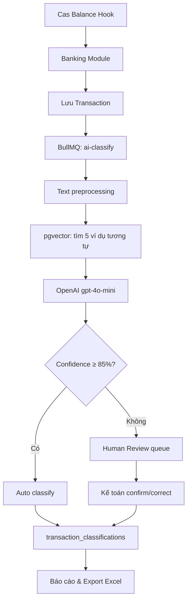

# X-Cash AI

**Nền tảng AI định khoản tự động cho SME Việt Nam** — nhận giao dịch ngân hàng real-time qua Cas Balance Hook, dùng AI để gợi ý bút toán theo chuẩn kế toán **TT133**, kế toán xác nhận qua Human Review, tổng hợp báo cáo thu chi và export Excel cuối tháng.

> Giảm thời gian nhập liệu thủ công, giảm sai sót định khoản, giúp doanh nghiệp nhỏ theo dõi thu chi mà không cần nhập từng giao dịch vào MISA/Excel.

> **Trạng thái:** Đây là **POC/MVP** (đồ án thực tập) — chứng minh luồng tích hợp Cas + AI định khoản chạy được trên **sandbox/local**. **Chưa go-live production**, chưa phải sản phẩm thương mại chính thức của Casso.

---

## Mục lục

- [Trạng thái dự án](#trạng-thái-dự-án)
- [Bài toán & Giải pháp](#bài-toán--giải-pháp)
- [Tính năng chính](#tính-năng-chính)
- [Luồng hoạt động](#luồng-hoạt-động)
- [Kiến trúc & Tech stack](#kiến-trúc--tech-stack)
- [Cấu trúc monorepo](#cấu-trúc-monorepo)
- [Cài đặt & Chạy local](#cài-đặt--chạy-local)
- [Biến môi trường](#biến-môi-trường)
- [Vai trò người dùng (RBAC)](#vai-trò-người-dùng-rbac)
- [API chính](#api-chính)
- [AI Classification](#ai-classification)
- [Lệnh phát triển](#lệnh-phát-triển)
- [Tài liệu chi tiết](#tài-liệu-chi-tiết)
- [Roadmap](#roadmap)
- [Team](#team)

---

## Trạng thái dự án

| | |
|---|---|
| **Giai đoạn** | POC/MVP — đủ demo end-to-end, chưa vận hành thương mại |
| **Môi trường** | Local + Cas **sandbox** (`sandbox.bankhub.dev`) |
| **Quan hệ với Casso** | Ứng dụng mở rộng trên hạ tầng Cas (Cas Link + Balance Hook); **không** phải sản phẩm Casso chính thức |
| **Mục tiêu MVP** | Chứng minh: nhận GD ngân hàng → AI gợi ý TK Nợ/Có TT133 → kế toán review → báo cáo |

**Đã có trong MVP (demo được):**

- Auth, onboarding Cas Link, webhook giao dịch, AI định khoản, Human Review
- Danh mục TK TT133, báo cáo tháng, export Excel
- Dashboard, multi-tenant, RBAC cơ bản

**Chưa có (go-live / Sprint 3–4):**

- Billing PayOS end-to-end (module + webhook + UI Settings)
- AI Copilot, Partner Dashboard
- Deploy production, tích hợp MISA/ERP, SLA vận hành

---

## Bài toán & Giải pháp

### Bài toán thực tế

Kế toán SME mỗi ngày nhận hàng chục giao dịch từ ngân hàng (qua Casso/Cas):

```
"CONG TY ABC CK TIEN HANG THANG 6"
"THANH TOAN HOA DON DIEN THANG 6"
"TRA LUONG NV NGUYEN VAN A"
"MUA VAN PHONG PHAM"
```

Hiện tại họ phải **tự đọc từng giao dịch → tự phân loại → tự gõ vào phần mềm kế toán hoặc Excel**. Tốn 30–60 phút mỗi ngày, dễ sai, khó tổng hợp báo cáo kịp thời.

### X-Cash AI làm gì

```
Giao dịch ngân hàng (Cas webhook)
        ↓
AI đọc nội dung → gợi ý định khoản TT133
        ↓
"TRA LUONG"     → Nợ 334 / Có 112  (Chi phí lương)
"TIEN HANG"     → Nợ 112 / Có 511  (Doanh thu bán hàng)
"HOA DON DIEN"  → Nợ 627 / Có 112  (Chi phí điện)
        ↓
Kế toán xác nhận (hoặc sửa nếu AI chưa chắc)
        ↓
Báo cáo thu chi real-time + Export Excel cuối tháng
```

**Đối tượng:** SME Việt Nam (quán cà phê, shop bán lẻ, công ty dịch vụ 5–50 người) — bất kỳ doanh nghiệp nào có tài khoản ngân hàng và cần theo dõi thu chi theo chuẩn kế toán.

---

## Tính năng chính

| Module | Mô tả | MVP |
|--------|--------|-----|
| **Đăng ký / Đăng nhập** | Multi-tenant SaaS, JWT + refresh cookie, tự seed danh mục TK TT133 khi tạo tenant | ✅ |
| **Onboarding Cas Link** | Liên kết tài khoản ngân hàng qua Cas SDK (sandbox) | ✅ |
| **Webhook Cas Balance Hook** | Nhận giao dịch real-time, idempotency Redis, enqueue AI classification | ✅ |
| **AI Định khoản tự động** | OpenAI `gpt-4o-mini` + pgvector few-shot, gợi ý TK Nợ/Có theo TT133 | ✅ |
| **Human Review** | Hàng chờ giao dịch AI chưa đủ tự tin — kế toán confirm / correct / skip | ✅ |
| **Giao dịch** | Danh sách + chi tiết giao dịch kèm kết quả định khoản | ✅ |
| **Danh mục TK (TT133)** | ~60 tài khoản chuẩn, CRUD theo tenant | ✅ |
| **Báo cáo** | Tổng thu / tổng chi / lãi lỗ / tỷ lệ định khoản, chi tiết theo TK, export Excel | ✅ |
| **Dashboard** | Thống kê định khoản hôm nay, chờ AI, chờ review, biểu đồ doanh thu | ✅ |
| **Billing PayOS** | Nâng cấp gói Free/Starter/Pro qua PayOS | 🔜 |
| **AI Copilot / Settings** | Hỏi đáp tự nhiên, cài đặt tenant | 🔜 |
| **Partner Dashboard** | Cas Partner quản lý tenant toàn hệ thống | 🔜 |

---

## Luồng hoạt động

### Hành trình người dùng (4 giai đoạn)

```
1. Đăng ký & Đăng nhập     →  Tạo tenant + admin, seed TT133
2. Onboarding (1 lần)      →  Liên kết ngân hàng qua Cas Link
3. Sử dụng hàng ngày       →  Webhook → AI định khoản → Human Review → Báo cáo
4. Nâng cấp gói (Sprint 3+) →  Billing qua PayOS khi hết quota Free
```

### Pipeline kỹ thuật



---

## Kiến trúc & Tech stack

| Tầng | Công nghệ |
|------|-----------|
| **Backend** | NestJS, TypeScript, Prisma, PostgreSQL + **pgvector**, Redis, BullMQ |
| **AI** | OpenAI API (`gpt-4o-mini` + `text-embedding-3-small`) — không tự train model |
| **Banking** | Cas Balance Hook (webhook) + Cas Link (onboarding) |
| **Frontend** | React, Vite, TypeScript, Tailwind v4, ShadCN/UI, TanStack Query, Recharts |
| **Monorepo** | Turborepo + pnpm workspaces |
| **Lint/Format** | Biome (thay ESLint + Prettier) |
| **Shared types** | `@xcash/shared-types` — enum Role, TransactionStatus, AccountType... |

**Hạ tầng local:** Docker Compose chạy PostgreSQL (pgvector) + Redis. Chi tiết deploy: [`deploy/README.md`](./deploy/README.md).

---

## Cấu trúc monorepo

```
x-cash-ai/
├── apps/
│   ├── backend/          # NestJS API — auth, banking, AI, classification, report...
│   └── frontend/         # React SPA — dashboard, giao dịch, review, báo cáo...
├── packages/
│   └── shared-types/     # Type & enum dùng chung BE + FE
├── agent-docs/           # Tài liệu nội bộ cho dev/agent (source of truth nghiệp vụ)
├── docker/               # Dockerfile backend + frontend
├── deploy/               # Hướng dẫn deploy VPS
├── docker-compose.yml    # PostgreSQL + Redis (+ profile fullstack)
├── biome.json            # Lint & format toàn repo
├── turbo.json
└── pnpm-workspace.yaml
```

**Backend modules hiện có:** `auth`, `banking`, `ai`, `chart-of-accounts`, `classification`, `report`, `transaction`, `onboarding`, `cas`, `health`.

**Frontend pages:** Dashboard, Giao dịch, Human Review, Báo cáo, Danh mục TK, Onboarding, Auth.

---

## Cài đặt & Chạy local

### Yêu cầu

- **Node.js** ≥ 20
- **pnpm** ≥ 10 (`corepack enable`)
- **Docker** + Docker Compose (PostgreSQL + Redis)

### Bước 1 — Clone & cài dependency

```bash
git clone https://github.com/lengocanh2005it/x-cash-ai.git
cd x-cash-ai
pnpm install
```

### Bước 2 — Cấu hình môi trường

```bash
cp .env.example .env
cp apps/backend/.env.example apps/backend/.env
cp apps/frontend/.env.example apps/frontend/.env
```

Điền tối thiểu:

- `DATABASE_URL` — khớp với `POSTGRES_*` trong `.env` root
- `JWT_ACCESS_SECRET`, `JWT_REFRESH_SECRET`
- `CAS_CLIENT_ID`, `CAS_SECRET_KEY` — lấy tại [Cas Sandbox Console](https://sandbox.console.bankhub.dev/developer/keys)
- `OPENAI_API_KEY` — (tùy chọn) không có key thì AI dùng rule-based fallback
- Dev local webhook: `WEBHOOK_SKIP_SIGNATURE_VERIFY=true` trong `apps/backend/.env`

### Bước 3 — Khởi động hạ tầng & migrate

```bash
docker compose up -d
pnpm --filter @xcash/backend exec prisma migrate deploy
```

### Bước 4 — Chạy ứng dụng

```bash
pnpm dev
# Backend:  http://localhost:3000
# Frontend: http://localhost:5173
# Swagger:  http://localhost:3000/api/docs
```

### (Tùy chọn) Seed dữ liệu demo

```bash
pnpm --filter @xcash/backend prisma:seed:demo
```

### Test webhook Cas ở local

**Cách 1 — Postman/curl (khuyến nghị cho dev):** gọi thẳng `POST http://localhost:3000/api/v1/webhook/cas` với `WEBHOOK_SKIP_SIGNATURE_VERIFY=true`.

**Cách 2 — Cas Console thật:** dùng `ngrok http 3000`, đăng ký URL public tại Cas Console → Webhooks → loại `TRANSACTIONS`.

Ví dụ mock webhook:

```bash
curl -X POST "http://localhost:3000/api/v1/webhook/cas" \
  -H "Content-Type: application/json" \
  -d '{
    "webhookType": "TRANSACTIONS",
    "grantId": "<grantId từ GET /api/v1/onboarding/status>",
    "transaction": {
      "id": "mock-txn-001",
      "amount": 1500000,
      "description": "Thanh toan HD001 Nguyen Van A",
      "transactionDateTime": "2026-07-02T10:30:00.000Z",
      "counterAccountName": "Nguyen Van A",
      "fiName": "VCB"
    }
  }'
```

Chi tiết đầy đủ: [`agent-docs/04-environment-setup.md`](./agent-docs/04-environment-setup.md)

---

## Biến môi trường

| File | Dùng cho |
|------|----------|
| `.env` (root) | Docker Compose (`POSTGRES_*`, `REDIS_PORT`) |
| `apps/backend/.env` | NestJS + Prisma |
| `apps/frontend/.env` | Vite (`VITE_API_BASE_URL`) |

| Nhóm | Biến quan trọng | Ghi chú |
|------|-----------------|---------|
| Database | `DATABASE_URL` | PostgreSQL, cần extension `pgvector` |
| Redis | `REDIS_URL` | Cache, BullMQ, webhook idempotency |
| JWT | `JWT_ACCESS_SECRET`, `JWT_REFRESH_SECRET` | Access 15m, refresh 7d (cookie) |
| OpenAI | `OPENAI_API_KEY`, `OPENAI_CHAT_MODEL` | Mặc định `gpt-4o-mini` |
| Cas | `CAS_CLIENT_ID`, `CAS_SECRET_KEY`, `CAS_GRANT_REDIRECT_URI` | Sandbox hoặc production |
| Webhook | `WEBHOOK_SKIP_SIGNATURE_VERIFY` | `true` khi dev local |
| AI | `AI_CLASSIFICATION_THRESHOLD` | Mặc định `85` (%) |

Bản tham chiếu đầy đủ: [`.env.example`](./.env.example)

---

## Vai trò người dùng (RBAC)

| Role | Mô tả |
|------|--------|
| `admin` | Toàn quyền trong tenant — quản lý TK, review, export, onboarding |
| `accountant` | Định khoản, review, báo cáo — không xóa tài khoản |
| `viewer` | Chỉ xem dashboard, giao dịch, báo cáo |
| `cas_partner` | System-level (`tenant_id = NULL`), chỉ route `/partner/*` |

Chi tiết ma trận phân quyền: [`agent-docs/reference/rbac.md`](./agent-docs/reference/rbac.md)

---

## API chính

Prefix: `/api/v1`

| Method | Path | Mô tả |
|--------|------|--------|
| `POST` | `/auth/register` | Đăng ký tenant + seed TT133 |
| `POST` | `/auth/login` | Đăng nhập |
| `GET` | `/auth/me` | User hiện tại |
| `POST` | `/onboarding/banking/grant-token` | Bắt đầu Cas Link |
| `GET` | `/onboarding/status` | Trạng thái liên kết ngân hàng |
| `POST` | `/webhook/cas` | Nhận giao dịch từ Cas (public, HMAC) |
| `GET` | `/transactions` | Danh sách giao dịch + classification |
| `GET` | `/review/queue` | Hàng chờ Human Review |
| `POST` | `/review/:id/confirm` | Xác nhận định khoản AI |
| `POST` | `/review/:id/correct` | Sửa TK Nợ/Có |
| `GET` | `/accounts` | Danh mục tài khoản TT133 |
| `GET` | `/reports/summary` | Tổng hợp tháng |
| `GET` | `/reports/export` | Export Excel `.xlsx` |

> **Lưu ý:** Có 2 webhook khác nhau — `POST /webhook/cas` (giao dịch ngân hàng, **đã có**) và `POST /webhook/payos-billing` (billing PayOS, **chưa implement**).

Swagger UI: `http://localhost:3000/api/docs`

---

## AI Classification

### Chuẩn kế toán TT133

X-Cash AI dùng **Thông tư 133/2016/TT-BTC** — bộ tài khoản phù hợp SME (~60 TK), seed sẵn khi đăng ký.

| Mã TK | Tên | Ví dụ |
|-------|-----|-------|
| 112 | Tiền gửi ngân hàng | Mọi GD qua TK ngân hàng |
| 334 | Phải trả người lao động | Trả lương |
| 511 | Doanh thu bán hàng | Tiền hàng vào |
| 627 | Chi phí sản xuất chung | Điện, nước |
| 642 | Chi phí quản lý | Văn phòng phẩm |

### Cách AI quyết định

1. **Chuẩn hóa** nội dung giao dịch tiếng Việt
2. **pgvector** tìm 5 phân loại cũ tương tự của cùng tenant (few-shot learning)
3. **OpenAI** trả JSON: `{ debit, credit, confidence, reason }`
4. **Confidence ≥ 85%** → tự động định khoản (`classified`)
5. **Confidence < 85%** → đưa vào Human Review (`review`)

Mỗi tenant học dần từ lịch sử định khoản của chính mình — càng dùng càng chính xác.

---

## Lệnh phát triển

Chạy từ **root** repo:

```bash
pnpm dev              # Chạy backend + frontend
pnpm dev:backend      # Chỉ backend (port 3000)
pnpm dev:frontend     # Chỉ frontend (port 5173)
pnpm build            # Build toàn bộ
pnpm lint             # Biome lint + format
pnpm type-check       # TypeScript check
pnpm test             # Chạy test
pnpm verify           # lint + type-check + test + build (chạy trước khi merge)
```

Migrate database:

```bash
pnpm --filter @xcash/backend exec prisma migrate deploy
pnpm --filter @xcash/backend prisma:generate
```

---

## Tài liệu chi tiết

| Tài liệu | Nội dung |
|----------|----------|
| [`agent-docs/00-current-state.md`](./agent-docs/00-current-state.md) | Trạng thái repo hiện tại — đọc đầu tiên khi dev |
| [`agent-docs/reference/business-overview.md`](./agent-docs/reference/business-overview.md) | Nghiệp vụ, kiến trúc, AI pipeline |
| [`agent-docs/reference/database-schema.md`](./agent-docs/reference/database-schema.md) | Schema PostgreSQL |
| [`agent-docs/reference/rbac.md`](./agent-docs/reference/rbac.md) | Phân quyền chi tiết |
| [`agent-docs/reference/ui-design.md`](./agent-docs/reference/ui-design.md) | Spec giao diện |
| [`agent-docs/reference/user-journey.md`](./agent-docs/reference/user-journey.md) | Hành trình người dùng |
| [`agent-docs/reference/sprint-plan.md`](./agent-docs/reference/sprint-plan.md) | Kế hoạch sprint |
| [`agent-docs/04-environment-setup.md`](./agent-docs/04-environment-setup.md) | Setup local đầy đủ |
| [`CLAUDE.md`](./CLAUDE.md) | Entry point cho AI coding agent |

---

## Roadmap

| Sprint | Trạng thái | Nội dung |
|--------|------------|----------|
| Sprint 1 | ✅ Xong | Auth, Cas Link, Webhook, Transactions |
| Sprint 2 | ✅ Xong | Pivot X-Cash AI — AI định khoản TT133, Human Review, Báo cáo, Export Excel |
| Sprint 3 | 🔜 Tiếp theo | AI Copilot, Settings + Billing PayOS, Analytics nâng cao |
| Sprint 4 | 📋 Kế hoạch | Partner Dashboard, Polish, Deploy production (go-live) |

Sau Sprint 2, repo ở mức **POC/MVP demo được** — đủ báo cáo thực tập / pitch ý tưởng, chưa sẵn sàng vận hành thương mại.

---

## Team

| Họ và tên | MSSV | Vai trò |
|-----------|------|---------|
| Lê Ngọc Anh | 23520048 | Backend & AI Developer |
| Lưu Nguyễn Thế Vinh | 22521653 | Full-stack Developer |

---

## License

Private — UNLICENSED. Dự án học tập / thực tập (POC/MVP), không phải sản phẩm thương mại go-live.
